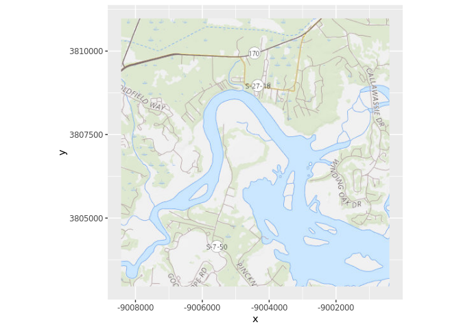
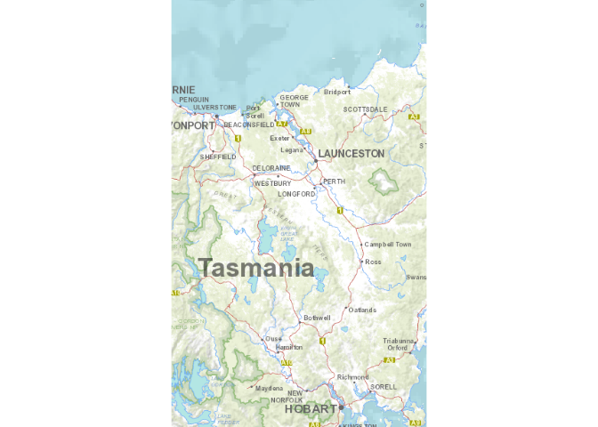
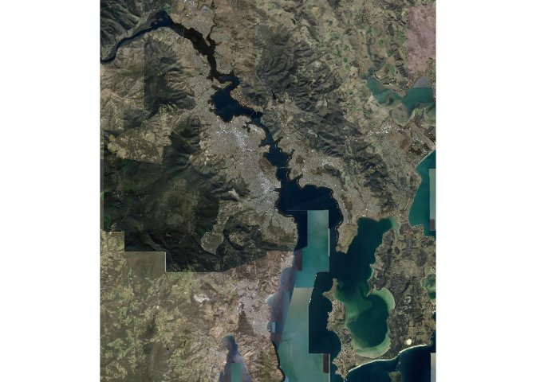
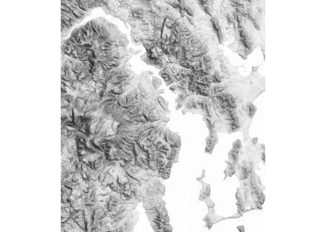
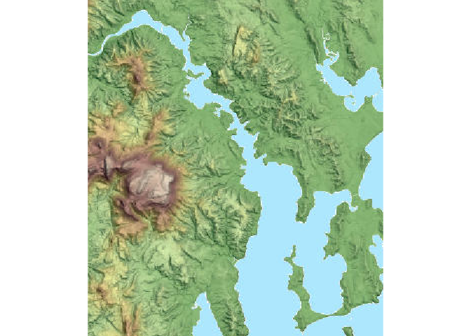
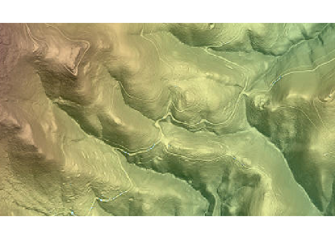
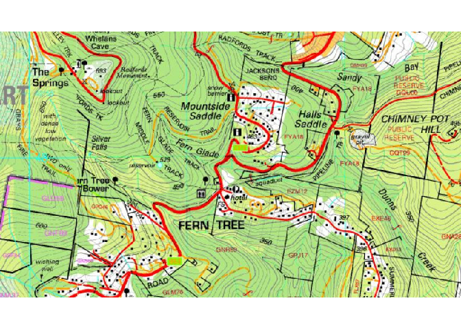
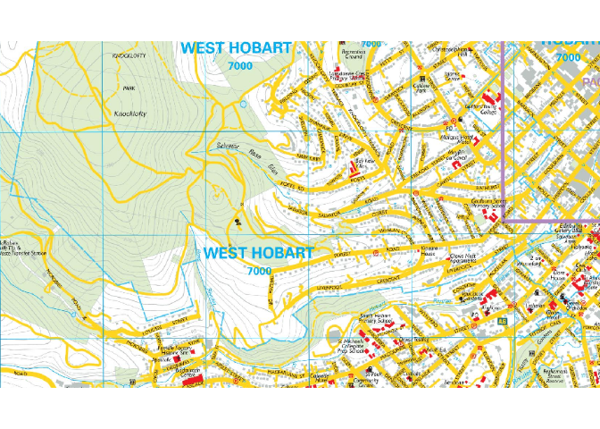
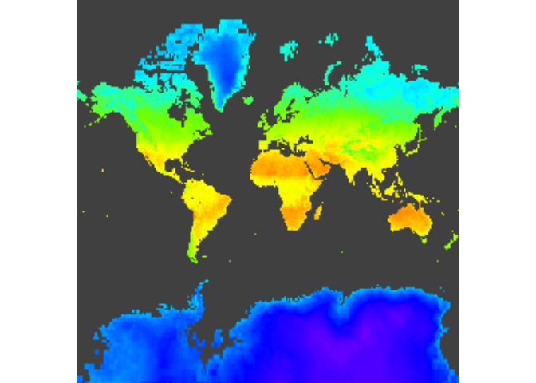
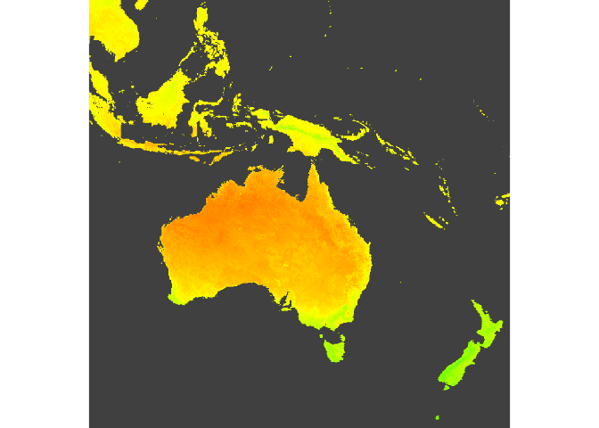

<!-- README.md is generated from README.Rmd. Please edit that file -->

# wmts

<!-- badges: start -->

[](https://travis-ci.org/mdsumner/wmts)
<!-- badges: end -->

The goal of wmts is to obtain imagery from online image servers. You can
provide *any URL* with a `GetCapabilities.xml` and quickly get an image
for any region at any resolution.

*Any URL*? Only Pseudo Mercator services tested so far, see examples
below for success stories. Please [file an issue]() or ping me [on
twitter](https://twitter.com/mdsumner)

## The wmts() function

Use `loc` to specify a location (`cbind(lon, lat)`) and `buffer` to give
a radius around that point in metres. Alternatively, any spatial object
can be used as `loc` and its extent (in the Mercator tile server
projection) will be used.

There is an argument `max_tiles` which is 9 by default (3x3 256x256
tiles) and ensures a reasonably small sized result. Increase max\_tiles
to obtain greater resolution (squares make sense, i.e. 16, 25, 36, 49, …
but the actual shape depends on `loc` and `buffer`).

The `zoom` argument can be used but please take care, the function will
report the zoom in use and it’s advisable not to increase this much (use
max\_tiles to get a known maximum amount of data).

See [GDAL WMTS documentation](https://gdal.org/drivers/raster/wmts.html)
for *technical details* on this GDAL-based approach.

## Beware

  - will create temporary files (gdalwmscache, and raster temp)
  - no checks for in-bounds for tiles
  - no safety checks if you manually set a large zoom
  - no idea what systems/OS this works on yet (tested on Ubuntu)

## TODO

  - \[x\] need to deal with various inputs
  - \[x\] fix URL forms (http/s vs WMTS:)
  - \[ \] add providers

## Example

``` r
## remotes::install_github("mdsumner/wmts")
centre <- c(-80.888, 32.332)  ## lonlat
radius <- 4000                ## metres
u <- "WMTS:https://basemap.nationalmap.gov/arcgis/rest/services/USGSTopo/MapServer/WMTS/1.0.0/WMTSCapabilities.xml,layer=USGSTopo,tilematrixset=default028mm"
library(wmts)

## note that input can be centre (longlat pt), buffer (km) or a spatial object (ignore buffer)
## output is a raster in World Mercator
x <- wmts(u, centre, buffer = radius) ## zoom determined interactively, don't use a hardcoded zoom
#> zoom: 13
raster::plotRGB(x, interpolate = TRUE)
```


``` r
#f <- system.file("gpkg/nc.gpkg", package = "sf", mustWork = TRUE)
#sf <- sf::read_sf(f)
#x <- wmts(u, sf)
tab <- tibble::as_tibble(raster::as.data.frame(x, xy = TRUE))
names(tab) <- c("x", "y", "red", "green", "blue")
##tab <- dplyr::filter(tab, !is.na(red))  ##... when we have missing values, we should drop them or rgb() will error
tab$hex <- rgb(tab$red, tab$green, tab$blue, maxColorValue = 255)
library(ggplot2)
ggplot(tab, aes(x, y, fill = hex)) +
  geom_raster(interpolate = TRUE) +
  coord_equal() +
  scale_fill_identity()
```



## Tasmania\!

Get a Tassie example.

``` r
ext <- raster::extent(146, 148, -43, -40.5)
u <- "WMTS:https://services.thelist.tas.gov.au/arcgis/rest/services/Basemaps/Topographic/MapServer/WMTS/1.0.0/WMTSCapabilities.xml,layer=Basemaps_Topographic,tilematrixset=default028mm"

img <- wmts(u, loc = ext)
#> zoom: 8
raster::plotRGB(img, interpolate = TRUE)
```



``` r

ortho <- wmts("https://services.thelist.tas.gov.au/arcgis/rest/services/Basemaps/Orthophoto/MapServer/WMTS/1.0.0/WMTSCapabilities.xml", raster::extent(147.125, 147.528, -43.054, -42.717), max_tiles = 16)
#> zoom: 11
raster::plotRGB(ortho, interpolate = TRUE)
```



``` r


## note that we can use an spatial object for the extent, saving much pain
url_shade <- "https://services.thelist.tas.gov.au/arcgis/rest/services/Basemaps/HillshadeGrey/MapServer/WMTS/1.0.0/WMTSCapabilities.xml"
greyshade <- wmts(url_shade, ortho)
#> zoom: 10
raster::plotRGB(greyshade, interpolate = TRUE)
```



``` r

prefix_shade <- "WMTS:https://services.thelist.tas.gov.au/arcgis/rest/services/Basemaps/HillshadeGrey/MapServer/WMTS/1.0.0/WMTSCapabilities.xml"
shade <- wmts(prefix_shade, ortho)
#> zoom: 10
# same: raster::plotRGB(shade, interpolate = TRUE)

prefix_shade <- "WMTS:https://services.thelist.tas.gov.au/arcgis/rest/services/Basemaps/Hillshade/MapServer/WMTS/1.0.0/WMTSCapabilities.xml"
hillshade <- wmts(prefix_shade, ortho)
#> zoom: 10
raster::plotRGB(hillshade)
```



``` r

zlocal <- raster::raster(raster::extent(c(16391003, 16394978, -5301061, -5298768)), crs = raster::projection(ortho))
zz <- wmts(prefix_shade, zlocal)
#> zoom: 14
raster::plotRGB(zz)
```



``` r

TasmapRaster <- "https://services.thelist.tas.gov.au/arcgis/rest/services/Basemaps/TasmapRaster/MapServer/WMTS/1.0.0/WMTSCapabilities.xml"
xx <- wmts(TasmapRaster, zlocal, max_tiles = 16)
#> zoom: 15
raster::plotRGB(xx)
```



``` r


street <- "https://services.thelist.tas.gov.au/arcgis/rest/services/Raster/TTSA/MapServer/WMTS/1.0.0/WMTSCapabilities.xml"
st <- wmts(street, raster::shift(zlocal, 5000, 5000), max_tiles = 36)
#> zoom: 16
raster::plotRGB(st)
```



A list of Tasmanian servers is here:
<https://services.thelist.tas.gov.au/arcgis/rest/services/Basemaps>

## Earthdata

You want the REST GetCapabilities(.xml), and we have to prefix with
“WMTS:” *and include* the layer name
(WIP).

<https://wiki.earthdata.nasa.gov/display/GIBS/GIBS+API+for+Developers#GIBSAPIforDevelopers-ServiceEndpointsandGetCapabilities>

``` r
u <- "WMTS:https://gibs.earthdata.nasa.gov/wmts/epsg3857/best/1.0.0/WMTSCapabilities.xml,layer=MODIS_Terra_L3_Land_Surface_Temp_Monthly_Day"
im <- wmts(u, cbind(0, 0), 20037508, zoom = 0)
#> zoom: 0
library(raster)
#> Loading required package: sp
plotRGB(im, interpolate = TRUE)
```



``` r

im2 <- wmts(u, extent(100, 180, -55, 15), max_tiles= 36)
#> zoom: 4

plotRGB(im2, interpolate = TRUE)
```

## 

Please note that the wmts project is released with a [Contributor Code
of
Conduct](https://contributor-covenant.org/version/1/0/0/CODE_OF_CONDUCT.html).
By contributing to this project, you agree to abide by its terms.
