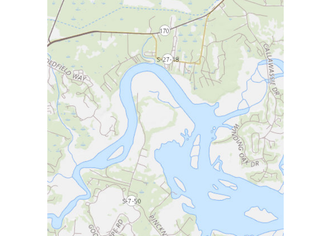

<!-- README.md is generated from README.Rmd. Please edit that file -->

# wmts

<!-- badges: start -->

[](https://travis-ci.org/mdsumner/wmts)
<!-- badges: end -->

The goal of wmts is to obtain imagery from WMTS image servers. See [GDAL
for details on WMTS](https://gdal.org/drivers/raster/wmts.html).

## Beware

  - will create temporary files (gdalwmscache, and raster temp)
  - no checks for in-bounds for tiles
  - no safety checks if you manually set a large zoom
  - no idea what systems/OS this works on yet (tested on Ubuntu)

## TODO

  - \[x\] need to deal with various inputs
  - \[x\] fix URL forms (http/s vs WMTS:)
  - \[ \] add providers

## Example

``` r
## remotes::install_github("mdsumner/wmts")
centre <- c(-80.888, 32.332)  ## lonlat
radius <- 4000                ## metres
u <- "WMTS:https://basemap.nationalmap.gov/arcgis/rest/services/USGSTopo/MapServer/WMTS/1.0.0/WMTSCapabilities.xml,layer=USGSTopo,tilematrixset=default028mm"
library(wmts)

## note that input can be centre (longlat pt), buffer (km) or a spatial object (ignore buffer)
## output is a raster in World Mercator
x <- wmts(u, centre, buffer = radius) ## zoom determined interactively, don't use a hardcoded zoom
#> zoom: 13
raster::plotRGB(x, interpolate = TRUE)
```



``` r
#f <- system.file("gpkg/nc.gpkg", package = "sf", mustWork = TRUE)
#sf <- sf::read_sf(f)
#x <- wmts(u, sf)
tab <- tibble::as_tibble(raster::as.data.frame(x, xy = TRUE))
names(tab) <- c("x", "y", "red", "green", "blue")
##tab <- dplyr::filter(tab, !is.na(red))  ##... when we have missing values, we should drop them or rgb() will error
tab$hex <- rgb(tab$red, tab$green, tab$blue, maxColorValue = 255)
library(ggplot2)
ggplot(tab, aes(x, y, fill = hex)) +
  geom_raster(interpolate = TRUE) +
  coord_equal() +
  scale_fill_identity()
```


## Tasmania\!

Get a Tassie example.

``` r
ext <- raster::extent(146, 148, -43, -40.5)
u <- "WMTS:https://services.thelist.tas.gov.au/arcgis/rest/services/Basemaps/Topographic/MapServer/WMTS/1.0.0/WMTSCapabilities.xml,layer=Basemaps_Topographic,tilematrixset=default028mm"

img <- wmts(u, loc = ext)
#> zoom: 8
raster::plotRGB(img, interpolate = TRUE)
```


``` r

ortho <- wmts("https://services.thelist.tas.gov.au/arcgis/rest/services/Basemaps/Orthophoto/MapServer/WMTS/1.0.0/WMTSCapabilities.xml", raster::extent(147.125, 147.528, -43.054, -42.717), max_tiles = 16)
#> zoom: 11
raster::plotRGB(ortho, interpolate = TRUE)
```

## 

Please note that the wmts project is released with a [Contributor Code
of
Conduct](https://contributor-covenant.org/version/1/0/0/CODE_OF_CONDUCT.html).
By contributing to this project, you agree to abide by its terms.
